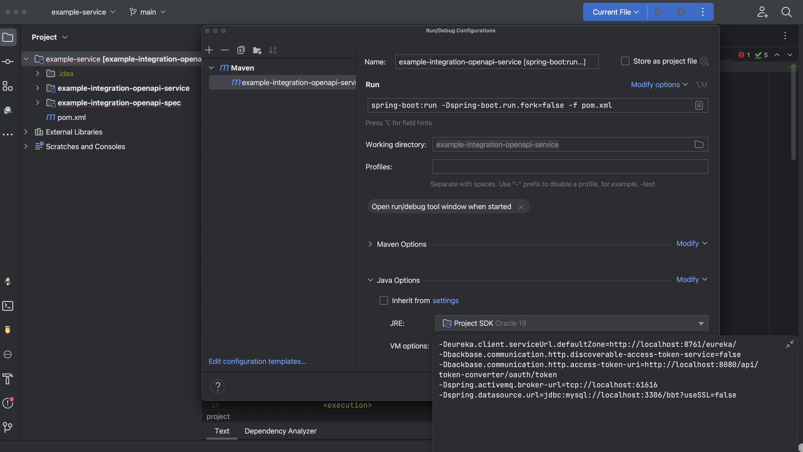
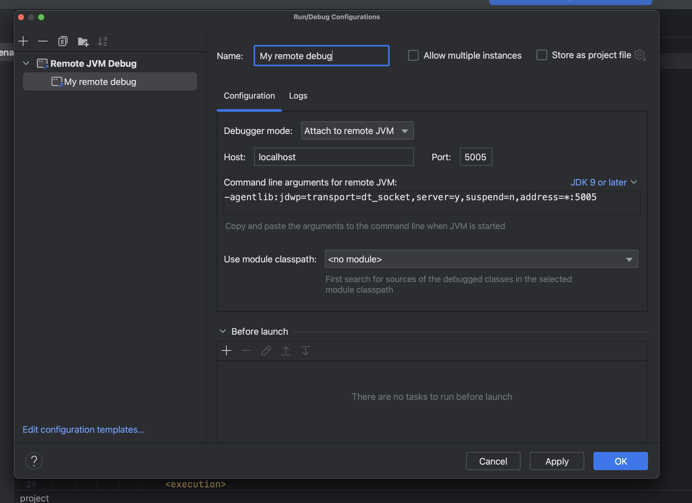

# Set up Backbase local environment

This guide shows you how to create a lightweight Backbase setup using a Docker Compose file.

## Contents
- [Prerequisites](#prerequisites)
- [Set up the Backbase local environment](#set-up-the-backbase-local-environment)
  - [Initial set up](#initial-set-up)
  - [Set up the local environment](#set-up-the-local-environment)
  - [Add services](#add-services)
  - [Ingest data](#ingest-data)
- [Health check](#health-check)
- [Upgrade your environment](#upgrade-your-environment)
- [Debug custom applications](#debug-custom-applications)
  - [Run the application locally](#run-the-application-locally)
  - [Debug remotely](#debug-remotely)
- [Troubleshooting](#troubleshooting)
  - [General issues](#general-issues)
  - [Colima](#colima)

## Prerequisites

For the setup, you must have the following:

- Any Docker runtime.
- Backbase repository credentials.

## Set up the Backbase local environment

### Initial set up

1. Install Colima to run Docker and work with Docker Compose:
    ```shell
    brew install colima docker docker-compose docker-credential-helper
    colima start --cpu 4 --memory 16
    ```
   Workaround to fix Colima issue [#764](https://github.com/abiosoft/colima/issues/764) in order to build the Identity Auth Server image using docker compose:
   ```shell
    docker buildx create --driver-opt 'image=moby/buildkit:rootless' 
    ```
   > **NOTE**: Installing Colima is only for macOS. For Windows-based systems, you can install Docker Desktop and run it to start the Docker service before going to the next step.
2. Log in to the Backbase repo:
    ```shell
    docker login repo.backbase.com
    ```

### Set up the local environment

1. View a list of all the running containers, with their status and configuration:
    ```shell
    docker ps
    ```
2. To set the Docker image for the version of Edge you are running, replace `2022.09.1` with the value of `BB_VERSION` in the [development/docker-compose/.env](https://github.com/backbase/local-backend-setup/blob/main/development/docker-compose/.env) file.:
    ```shell
    docker pull repo.backbase.com/backbase-docker-releases/edge:`2022.09.1`
    ```

3. From the Docker Compose directory, start up the environment:
    ```shell
    docker compose up -d
    ```
   > **NOTE**: The Postman health check and Newman runs on `docker compose up`. For more information, see [Health check](#health-check).

4. Add the `bootstrap` profile on the first run to ingest data into Banking Services:
    ```shell
    docker compose --profile=bootstrap up -d
    ```
5. To display the log output for all services specified in the `docker-compose.yaml` file and continuously update the console with new log entries:
    ```shell
    docker compose logs -f
    ```
6. To access your environment, use the following endpoints:
    - **Identity**: http://localhost:8180/auth
      * **Realm Admin Credentials**: `admin` / `admin`
    - **Edge Gateway**: http://localhost:8280/api
    - **Registry**: http://localhost:8761
7. Verify the health of your environment to ensure services are running: 
    ```shell
    docker compose ps
    ```
    For a more detailed check of your environment, use the Postman collection from the `./test` directory. For more information, see [Health check](#health-check).

8. If you want to stop or kill containers, use one of the following:
    - Stop and remove containers in the Docker Compose file:
        ```shell
        docker compose down
        ```
    - Kill all running containers in the host:
        ```shell
        docker kill $(docker ps -q)
        ```

### Add services

By default, the following Backbase services are available:

- Edge
- Registry
- Identity Server
  * With `backbase` realm included.
- Identity Integration
- Token Converter
- Access Control
- Arrangement Manager
- User Manager

To add more services in the environment, insert their configuration into the `docker-compose.yaml` file.

Before proceeding, make sure that the Docker Registry is accessible.

1. Replace `SERVICE-NAME` with the service you want to add. For more information, see [Backend artifacts](https://community.backbase.com/documentation/DBS/latest/backend_artifacts).
2. Set your Docker image configuration.
3. Set the `PORT` which the service exposes.
4. You can add the following to the service environment variables:
   - To include common configurations, such as registry and signature keys, add `*common-variables`. 
   - If a database is required for your service, add `*database-variables`.
   - If the service utilizes events, include `*message-broker-variables`.

The following is an example configuration:

```yml
  <SERVICE-NAME>:
    container_name: <SERVICE_NAME>
    image:  <DOCKER-REGISTRY>/<DOCKER-REPOSITORY>:<TAG>
    ports:
      - "<PORT>:8080"
    environment:
      <<: *common-variables
      <<: *message-broker-variables
      <<: *database-variables
    volumes:
      - ./scripts:/tmp/h
    healthcheck:
      <<: *healthcheck-defaults
      test: [ "CMD", "java", "/tmp/h/HealthCheck.java", "http://registry:8080/eureka/apps/<SERVICE-NAME>", "<status>UP</status>" ]
    links:
      - registry
```

### Ingest data

The following tasks ingest data:
- Product catalog task
- Legal entity bootstrap task

   > **NOTE**: For demonstration purposes, the `moustache-bank` and `moustache-bank-subsidiaries` profiles are [enabled and pre-configured](https://github.com/Backbase/stream-services/blob/master/stream-legal-entity/legal-entity-bootstrap-task/src/main/resources/application.yml#L24) in the Stream services.

## Health check
In addition to the default health check that is provided when you use `docker compose up`, the following steps describe how to perform a more comprehensive health check on your environment using Postman:

1. Import the Postman collection from the `./test` directory.
2. Run the <b>Health Check</b> folder.
3. When all the tests pass they will change to green. This indicates that the environment is up and healthy.

    >    **NOTE**: It may take several minutes for all the services to start running. You may need to rerun the test folder multiple times until all the tests pass. 
   > 
   > If you have `jq` installed, you can display a neatly formatted output of all the services and their current health status:
    > ```shell
    > docker compose ps --format json | jq  'map({Service: .Name, Status: .Health})'
    > ```


## Upgrade your environment

To upgrade a service in the environment, change the Docker image tag to the new version. Verify that this version is compatible with the other services in the environment. 

To upgrade all services to a specific Backbase BOM version, change the `BB_VERSION` value in the [development/docker-compose/.env](https://github.com/backbase/local-backend-setup/blob/main/development/docker-compose/.env) file.

## Debug custom applications

You can debug your custom application in the local environment by either running it locally and using the environment, or by running it in the environment and using remote debugging.

### Run the application locally

To connect your application to the local environment, you can run it in the IDE and configure it to use services such as MySQL, ActiveMQ, Token Converter, and Registry. Do this by adding JVM options to the run configuration, or by editing the `application.yaml` file.

The following is an example configuration:
```
-Deureka.client.serviceUrl.defaultZone=http://localhost:8761/eureka/
-Dbackbase.communication.http.discoverable-access-token-service=false
-Dbackbase.communication.http.access-token-uri=http://localhost:7779/oauth/token
-Dspring.activemq.broker-url=tcp://localhost:61616
-Deureka.instance.hostname=host.docker.internal
```
To start an application in debug mode using, for example, IntelliJ IDE, do the following:

1. Add a new Maven run configuration in IntelliJ.
2. Ensure that the working directory points to the relevant project.
3. Use the Maven command:
    ```
    spring-boot:run -Dspring-boot.run.fork=false -f pom.xml
    ```
4. Set the VM options for the application to use the local setup.
5. Run the created configuration in debug mode.

    


### Debug remotely

To debug your Docker image remotely inside the local environment, do the following in your IDE:

1. Generate the Docker image locally to build a Service SDK-based custom application:
    ```
    mvn clean package -Pdocker-image,local-client -Ddocker.repo.url=local
    ```
2. Add the custom service to the `docker-compose.yaml` file and set the debug agent in the application configuration. The following is an example configuration:
    ```yml
      example-service:
        container_name: example_service
        image:  local/development/example-integration-openapi-service:latest
        ports:
          - "8090:8080"
        environment:
          <<: *common-variables
          eureka.client.enabled: 'true'
          JAVA_TOOL_OPTIONS: '-agentlib:jdwp=transport=dt_socket,server=y,suspend=n,address=*:5005'
        volumes:
          - ./scripts:/tmp/h
        healthcheck:
          <<: *healthcheck-defaults
          test: [ "CMD", "java", "/tmp/h/HealthCheck.java", "http://registry:8080/eureka/apps/example-service", "<status>UP</status>" ]
        links:
          - registry
    ```
   To enable a Java agent on port 5005, add it to `JAVA_TOOL_OPTIONS`. If you are debugging multiple applications at the same time, use different debug ports for each application.


3. Create a Remote JVM Debug run configuration in your IDE and specify the port and arguments for each service added. The following example is for the IntelliJ IDE:

    

4. Select the created configuration and run it in debug mode. When a breakpoint is reached during the run, the IDE switches to the debugger view and switches between tabs if multiple debug configurations for different applications are started.


## Troubleshooting

If the environment is not working, or if some or all of its services are not in a healthy state, do any of the following to troubleshoot the issue:

### General issues

- Check that the Docker daemon is running in the background:
  ```shell
  docker version
  ```
- Check the MySQL instance by using the Telnet command to verify that port 3306 is open and listening:
  ```shell
  telnet localhost 3306
  ```
- Check the Registry service in the browser [http://localhost:8761](http://localhost:8761).
- Check the Edge routes [http://localhost:8280/actuator/gateway/routes](http://localhost:8280/actuator/gateway/routes).
- If the health check task fails and you are operating in a new environment, ensure that you include `--profile=bootstrap` in your command.

### Colima
- If you encounter an error when running `docker compose up` in Colima, this may be caused by a problem with mounts in Docker. 
  - Symptoms include failed health checks for `Identity`, failed API calls for authentication. However, you should be able to log in using the Admin Console UI. 
  - The error message indicates that the collection could not be loaded and that there was an illegal operation on a directory. For example:
    ```
    postman_checks  | error: collection could not be loaded
    postman_checks  |   unable to read data from file "/etc/newman/Local-Backend-Environment.postman_collection.json"
    postman_checks  |   EISDIR: illegal operation on a directory, read
    ```
    
- A workaround is to use `colima delete`, but use caution as this deletes everything and restarts Colima. 
- You can also apply mount settings to your `colima` configuration and start Colima again with options for mounts.
  ```shell
  # If you don’t have any important settings to lose, you can use this option as a last resort.
  # Step 1. Run:
  colima delete
  # Step 2. Start Colima again with your usual options, but add an option for mounts.
  # Run (for example):
  colima start --cpu 8 --memory 16 --with-kubernetes --mount-type 9p
  ```

## Useful Hints

### Configuring CORS in Edge
In order to configure CORS in Edge, you can set the `SPRING_APPLICATION_JSON` in docker-compose.yaml file. A very common example is connecting a webapp from a different domain (or locally from a different port) to the local backend setup. In this case, the edge should be configured to allow from all origins. Following is such a configuration:

```yaml
  edge:
    image: repo.backbase.com/backbase-docker-releases/edge:${BB_VERSION}
    ports:
      - "8280:8080"
    environment:
      <<: *common-variables
      gateway.actuator.security.enabled: false
      gateway.csrf.enabled: false
      SPRING_APPLICATION_JSON: '{ "gateway": { "csrf": { "enabled": false } }, "spring": { "cloud": { "gateway": { "globalcors": { "corsConfigurations": { "[/**]": { "allowedOriginPatterns": "*", "exposedHeaders": "*", "allowedHeaders": "*", "allowedMethods": [ "GET", "POST", "OPTIONS", "PUT", "PATCH", "DELETE" ] } } } } } } }'
```


